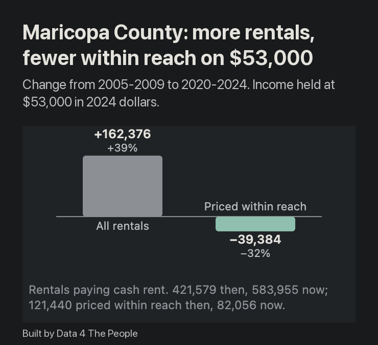

# Rentals Within Reach: Visualizing the Affordability of Rentals Where You Live

We’ve heard the story.

Renters are getting squeezed.

In fact, I was [interviewed about this](https://www.data4thepeople.com/p/renters-are-falling-behind) months ago, right after the ACS 5-year survey data dropped covering the 2020-2024 period. I did the math at the national level, and learned two things:

1. The median U.S. homeowner household’s income ($100,009) is nearly twice that of the median U.S. renter household ($52,966).
2. Over the prior five years, the median monthly rent increased by 33.1%, while the median housing costs for homeowners increased by 20.9%.

Based on these two findings, and a whole lot more, I titled the post “Squeezed on Both Ends.” Because that’s what renters were facing – higher shelter price inflation and much lower absolute income to cover higher costs.

## From national data to local data

But that was way back on February 19, 2026 – the days before we discovered how to leverage AI to assist with our data journalism process. And so, I was stuck analyzing national data, which as I have said over and again, no one person actually experiences.

We can analyze national data to understand America.

But we must move to analyzing local data to understand Americans.

I want to understand Americans, not America. And as we show you five days a week, we now have the tools to do this.

## Meet Rentals Within Reach

That said, please meet the newest member of our visualization team – D4TP’s Rentals Within Reach visualization. It starts by asking one question – if your family earned the median renter’s household income and wanted to pay no more than 30% of your after-tax income on rent (a stricter take on the usual 30% rule of thumb), how many units in your county could you afford? The map shows you this. And all the red? Those are the counties where fewer than 40% of the total rental units in your county were in your price range.

<iframe src="https://data4thepeople.github.io/AffordableHousing/?v=20261008a#embed=1" width="100%" height="780" loading="lazy" style="border:0" title="Rentals Within Reach: interactive map of rentals a household can afford, by county, 2005-2009 to 2020-2024"></iframe>

::: spacer 40px

The map uses the Census Bureau’s American Community Survey 5-year estimates of gross rent and household income for every U.S. county, in four periods from 2005-2009 to 2020-2024. Rentals Within Reach is free to use, with no signup.

## How to use it

That’s just the default view. But this visualization is loaded with different bells and whistles that can help you explore this topic and really get a sense for how difficult it is to find an affordable rental across America.

Feel free to head over to [GitHub](https://github.com/Data4ThePeople/AffordableHousing) for step-by-step written instructions on how to use this new visualization. You’ll find the detailed methodology there too. But to save words today, we’ve created a one-minute tutorial video. We strongly encourage you to watch this to get a feel for everything this viz can do.

<iframe src="https://www.youtube-nocookie.com/embed/zs0lN6o3SdE?rel=0" width="100%" height="440" loading="lazy" style="border:0" title="How to use Rentals Within Reach (57-second video)" allow="accelerometer; autoplay; clipboard-write; encrypted-media; gyroscope; picture-in-picture; web-share" allowfullscreen></iframe>

::: spacer 40px

## A thought experiment: An entry-level teacher looking for a place to live

There are so many stories we want to tell from this visualization. And we will tell many of them over time. But for now, we will just present a single thought experiment. This one comes from the mind of Data 4 The People founding data architect, Amanda Sinton, who, before she became a data scientist, was an elementary school teacher.

You live in Arizona and just graduated with your bachelor’s degree in education and are ready to go teach at an elementary school in Phoenix. But you need a place to live, and one that ideally you can pay for on 30% of what is left of your $53,000 salary after taxes. Your friend tells you about this neat new free tool at Data 4 The People, so you head over to the site, choose Arizona from the dropdown, plug your salary in (note: we have no access to any user-entered data! It all lives in your browser), set “Taxed as” to single and study the data.

*Arizona counties on a $53,000 income, 2020-2024, at 30% of after-tax income for a single person. Maricopa County is outlined.*

You find out that of the 583,955 rental units in Maricopa County, you can afford just 14% at 30% of your post-tax income.

*Maricopa County rentals by monthly rent. The dashed line is the $1,087 a month this income supports.*

But it gets worse. You scroll down the right panel and learn that over the past 15 years the units that you could have afforded on this salary, adjusted for inflation, have declined 32%, despite overall units increasing by 39%! So, overall rental units are way up in your county…just not ones you can afford.

*From 2005-2009 to 2020-2024, Maricopa County added 162,376 rentals. The number priced within reach of this income fell by 39,384.*

### The choices from here

And so what do you do? Do you decide to shell out 50% of your income for a fancy Phoenix rental? If so, now you can afford 57% of all units… but how is that going to set you up for the future?

*The same income at 50% of after-tax pay. The ceiling rises to $1,811 a month.*

Or, you could look a few counties away in Santa Cruz County. You may make just $45,000 per year there (pre-tax), but rental units are far cheaper. At your desired 30% of post-tax income level, 61% of the units there are in reach.

*Santa Cruz County, Arizona, on $45,000: a $932 monthly ceiling.*

## What this does not tell you

The teacher's search would be harder than the map suggests in some ways, and the tool leaves some things out.

- **It counts rentals people live in now, not vacancies.** The Census Bureau records what current tenants pay. A unit rented at a low price for many years counts the same as one on the market today. The share a new arrival can find is very likely lower than the share shown.
- **A unit priced within reach may not be open.** Many low-rent units are already rented, some of them by households that earn more.
- **Size is not counted.** A studio and a three-bedroom count the same.
- **Taxes are estimated.** After-tax income is figured for one wage earner with no other income, using federal and state income tax and payroll tax. Local income taxes are left out.
- **Small counties are less certain.** Santa Cruz County has 4,690 rentals. Maricopa County has 583,955. Figures for small counties rest on fewer survey responses.

The full list of limits, and the method, is on [GitHub](https://github.com/Data4ThePeople/AffordableHousing).

## Try it yourself

This is how we understand Americans. We create the story and the tool to simulate their lives, and then see how it plays out. Are we missing elements of the story? Of course we are. These tools are not perfect. The only way to get to perfect is to actually live that other person’s life. But we can at least gain an appreciation for what they must have to go through using the data.

So, take this tool for a spin and go learn about Americans who you have never met. We are going to come back to this tool many times in the coming months. We have identified several amazing stories, and will get to them all in due time. But we’d love to see what you find first. Let us know if you come across a good story that opens your eyes to someone else’s lived experience and we may just publish it (with credit to you of course!).
